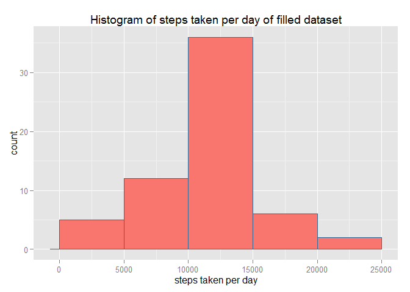

# Reproducible Research: Peer Assessment 1


## Loading and preprocessing the data

Unzip and read activity data

```r
unzip ("./activity.zip")
activity <- read.csv ("./activity.csv")
```
Delete csv file

```r
unlink ("./activity.csv")
```
Convert Date column to Date format

```r
activity$date <- as.Date (activity$date, "%Y-%m-%d")
```


## What is mean total number of steps taken per day?

Sum of number of steps taken per day

```r
steps_day <- tapply (activity$steps, activity$date, sum)
```
Plot histogram of steps taken per day

```r
library (ggplot2)
```

```
## Warning: package 'ggplot2' was built under R version 3.1.3
```

```r
plot <- qplot (steps_day, fill="red", col=0)
plot <- plot + stat_bin (binwidth=5000, origin=0)
plot <- plot + theme(legend.position="none")
plot <- plot + labs (title ="Histogram of steps taken per day")
plot <- plot + labs (x ="steps taken per day")
plot
```

 

```r
dev.off()
```

```
## null device 
##           1
```
Mean of the total number of steps taken per day

```r
mean (steps_day, na.rm=TRUE)
```

```
## [1] 10766.19
```
Median of the total number of steps taken per day

```r
median (steps_day, na.rm=TRUE)
```

```
## [1] 10765
```


## What is the average daily activity pattern?

Average of number of steps taken by each 5-minute interval of the day

```r
mean_stepsinterval <- tapply (activity$steps, activity$interval, mean, na.rm=TRUE)
mean_stepsinterval <- data.frame (steps=mean_stepsinterval, interval=as.integer(names(mean_stepsinterval)))
```
Plot time series with the previous mean

```r
plot2 <- qplot (interval, steps, data=mean_stepsinterval, aes (x=x, y=y))
plot2 <- plot2 + geom_line(color="lightgreen", lwd=1.2)
plot2 <- plot2 + geom_point(color="lightgreen")
plot2 <- plot2 + labs (title ="Steps by interval")
plot2
```

 

```r
dev.off()
```

```
## null device 
##           1
```
The 5-minute interval with maximum number of steps and the number of steps, on average, are

```r
mean_stepsinterval$interval [mean_stepsinterval$steps == max (mean_stepsinterval$steps)]
```

```
## [1] 835
```

```r
max (mean_stepsinterval$steps)
```

```
## [1] 206.1698
```


## Imputing missing values

The number of missing values in the dataset is

```r
sum (is.na (activity$steps))
```

```
## [1] 2304
```
Replace missing values by the mean of the same 5-minute interval

```r
steps_fill <- rep (NA, length (activity$steps))
for (i in seq_along (activity$steps)) {
        if (is.na (activity$steps [i])) {
                steps_fill [i] <- mean_stepsinterval$steps [mean_stepsinterval$interval==activity$interval [i]]
        } else {
                steps_fill [i] <- activity$steps [i]
        }
}
```
New dataset called "activity_fill" that is equal to the original dataset with the missing values filled in

```r
activity_fill <- data.frame (steps=steps_fill, date=activity$date, interval=activity$interval)
```
Sum of number of steps taken per day of the filled dataset

```r
stepsfill_day <- tapply (activity_fill$steps, activity_fill$date, sum)
```
Plot histogram of steps taken per day of filled dataset

```r
plot3 <- qplot (stepsfill_day, fill="red", col=0)
plot3 <- plot3 + stat_bin (binwidth=5000, origin=0)
plot3 <- plot3 + theme(legend.position="none")
plot3 <- plot3 + labs (title ="Histogram of steps taken per day of filled dataset")
plot3 <- plot3 + labs (x ="steps taken per day")
plot3
```

 

```r
dev.off()
```

```
## null device 
##           1
```
All bars have the same length that the histogram of the first part except the bar in the middle of the plot, that is greater

Mean of the total number of steps taken per day

```r
mean (stepsfill_day)
```

```
## [1] 10766.19
```
Mean is the same of the first part

Median of the total number of steps taken per day

```r
median (stepsfill_day)
```

```
## [1] 10766.19
```
Median is different of the first part but equal of mean.


## Are there differences in activity patterns between weekdays and weekends?
create a new colum in activity_fill data frame indicating if the date of the row is "weekday" or "weekend"

```r
weekday <- rep (NA, length (activity_fill$date))
for (i in seq_along (activity_fill$date)) {
        if (weekdays (activity_fill$date[i]) == "sábado" | weekdays (activity_fill$date[i]) == "domingo") {
                weekday [i] <- "weekend"
        } else {
                weekday [i] <- "weekday"
        }
}
activity_fill <- data.frame (activity_fill, weekday)
```
Plots containing a time series plot of the 5-minute interval and the average number of steps taken, averaged across all weekday days or weekend days

```r
library (lattice)
```

```
## Warning: package 'lattice' was built under R version 3.1.3
```

```r
activity_fill$interval <- as.factor (activity_fill$interval)
mean_stepsweekdays <- aggregate (activity_fill$steps, by = list (activity_fill$weekday, activity_fill$interval), FUN=mean)
names (mean_stepsweekdays) <- c("weekday", "interval", "steps")
mean_stepsweekdays$interval <- as.integer (mean_stepsweekdays$interval)
xyplot (steps ~ interval | weekday, data=mean_stepsweekdays, type="l", main="Steps by interval", layout=c(1,2))
```

 

```r
dev.off()
```

```
## null device 
##           1
```
